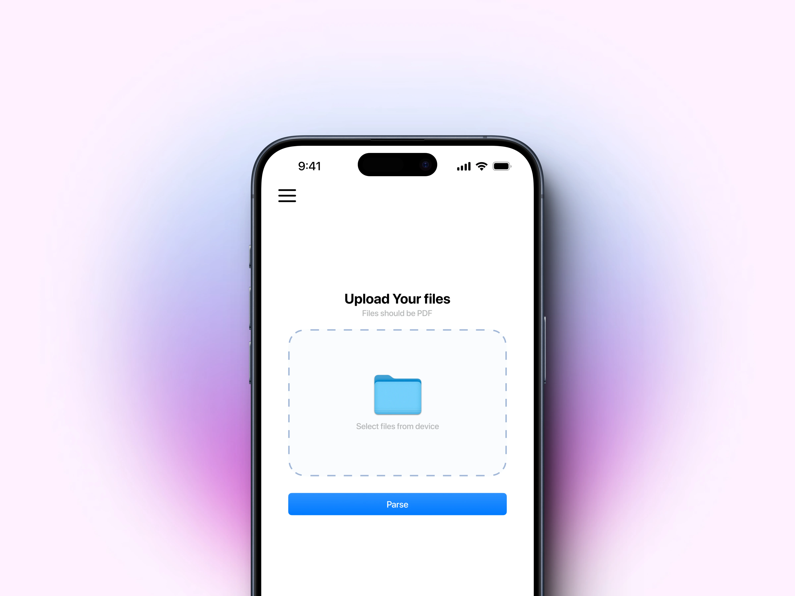

<div align="center">
  <a href="https://hoppscotch.io](https://github.com/Schematic-Bytes/Resumify/">
    
  </a>
  <h3>
    <b>
      Resumify
    </b>
  </h3>
  <b>
    Your resume parsing tool
  </b>
      
        
          
          
          
            
</div>

## Table of Contents
1. [Introduction](#introduction)
2. [Features](#features)
3. [Installation](#installation)
4. [Usage](#usage)
5. [License](#license)

---

## 1. Introduction <a name="introduction"></a>

Welcome to the Resume Parsing Tool, a powerful application designed to automatically extract and populate essential details from resumes or CVs. This documentation provides an overview of the tool, its features, installation instructions, and guidance on how to use it.

## 2. Features <a name="features"></a>

Our Resume/CV Parsing Tool offers the following key features:

- *Automatic Data Extraction:* The tool automatically extracts and populates the following information from resumes or CVs:
  - Name
  - Email
  - Mobile Number
  - Gender
  - Highest Qualification
  - College
  - Specialization/Branch
  - Year of Graduation

- *User-Friendly Interface:* The application is designed with a user-friendly interface for ease of use.

- *High Accuracy:* Utilizes advanced parsing algorithms to ensure accurate data extraction.

## 3. Installation <a name="installation"></a>

### Prerequisites
- Flutter
- Dart

### Steps
1. Clone this GitHub repository:

  ```bash
https://github.com/yourusername/resume_parser.git
```

2. Navigate to the project directory:

   `cd resume_parser`
   
3. Locate the config.dart file in your project. This file contains important configurations, including the server URL.

4. Replace with the URL of your server. Ensure the URL is accurate and complete.

5. Run the application:
   
   `Flutter run`
   

## 4. Usage <a name="usage"></a>

1. Open the application as instructed in the installation steps.

2. Upload a resume or CV document.

3. Click the "Upload" button.

4. The tool will automatically extract and display the essential information in a user-friendly format.


## 6. License <a name="license"></a>

This project is licensed under the [AGPL License](LICENSE).

---

Thank you for using our Resume/CV Parsing Tool. If you encounter any issues or have suggestions for improvement, please don't hesitate to [report them](https://github.com/yourusername/resume-cv-parser/issues). We hope this tool enhances efficiency for job seekers by simplifying the application process. Happy parsing!
